<p align="center"></p>

# ARIA - AI Knowledge Assistant

**Project ARIA** - Advanced RAG-powered knowledge assistant with intelligent document processing and natural language query capabilities.

## 🎯 Overview

ARIA (Advanced Retrieval-Augmented Intelligence Assistant) is a sophisticated knowledge management system that combines:
- **RAG (Retrieval-Augmented Generation)** for accurate, context-aware responses
- **Multi-format document ingestion** (Markdown, text)
- **Intelligent semantic search** using sentence transformers
- **Multiple LLM provider support** (OpenAI, Google Gemini, Community models)
- **FastAPI-based REST API** for seamless integration
- **Vector database storage** via ChromaDB for efficient retrieval

## 🚀 Features

### Core Capabilities
- **Smart Document Ingestion**: Automatic parsing and processing of markdown and text documents
- **Semantic Search**: Advanced similarity search using sentence-transformers
- **Multi-Provider LLM Support**: OpenAI GPT, Google Gemini, and LangChain community models
- **Vector Database**: Efficient storage and retrieval using ChromaDB
- **RESTful API**: FastAPI-based backend for easy integration
- **Configuration Management**: YAML-based prompt and configuration management
- **Comprehensive Testing**: Full test suite with pytest and async support

### Technical Highlights
- **LangChain Integration**: Leverages LangChain for RAG chain orchestration
- **Frontmatter Support**: Handles markdown with metadata via python-frontmatter
- **Environment Configuration**: Secure configuration via python-dotenv
- **Async/Await**: Modern asynchronous Python patterns
- **Type Safety**: Pydantic models for data validation

## 🛠️ Installation

```bash
# Clone the repository
git clone https://github.com/adventurewave-labs/aria.git
cd aria

# Create virtual environment
python3.11 -m venv venv
source venv/bin/activate  # On Windows: venv\Scripts\activate

# Install dependencies
pip install -r requirements.txt

# Configure environment
cp .env.example .env
# Edit .env with your API keys
```

## ⚙️ Configuration

### Environment Variables
```bash
# Required
OPENAI_API_KEY=your_openai_api_key
GOOGLE_API_KEY=your_google_api_key

# Optional
LANGCHAIN_API_KEY=your_langchain_api_key
LANGCHAIN_TRACING_V2=true
LANGCHAIN_PROJECT=aria-knowledge-assistant

# Server
HOST=0.0.0.0
PORT=8000

# Production hardening
CORS_ORIGINS=https://app.example.com,https://admin.example.com  # comma-separated allowlist; empty = wildcard without credentials
API_KEY=your_api_key                                            # when set, required via the X-API-Key header; empty disables auth
DEDUP_STORE_PATH=./aria_dedup.json                              # persists ingest dedup keys across restarts; empty = in-memory only
LOG_LEVEL=INFO                                                  # structured JSON logging level
```

### Security & Operations

- **CORS**: Cross-origin access is controlled by `CORS_ORIGINS`. Credentialed
  requests are only permitted when origins are explicitly listed; an empty value
  falls back to a wildcard origin **without** credentials.
- **Authentication**: Setting `API_KEY` enables API-key auth on `/ingest`,
  `/query`, and `/metrics`. Clients must send the key in the `X-API-Key` header.
  `/health` is always public for load-balancer probes.
- **Structured logging**: Logs are emitted as single-line JSON to stdout,
  including per-request `method`/`path`/`status`/`latency_ms` and structured
  ingest/query events.
- **Ingest deduplication**: Identical `source` + content is only ingested once;
  the dedup index is persisted to `DEDUP_STORE_PATH` so it survives restarts.

### Prompts Configuration
Edit `config/prompts.yaml` to customize system prompts and behavior templates.

## 📖 Usage

### Starting the Server
```bash
# Development server
uvicorn app.main:app --reload --host 0.0.0.0 --port 8000

# Production server
uvicorn app.main:app --host 0.0.0.0 --port 8000 --workers 4
```

### API Endpoints

#### Health Check
```bash
curl http://localhost:8000/health
```

> When `API_KEY` is configured, add `-H "X-API-Key: your_api_key"` to the
> `/ingest`, `/query`, and `/metrics` requests below.

#### Ingest Documents
```bash
curl -X POST http://localhost:8000/ingest \
  -H "Content-Type: application/json" \
  -d '{"content": "# Title\n\nBody text.", "source": "document.md"}'
```

#### Query Knowledge Base
```bash
curl -X POST http://localhost:8000/query \
  -H "Content-Type: application/json" \
  -d '{"question": "What is the main topic?", "top_k": 5}'
```

## 🏗️ Project Structure

```
aria/
├── app/
│   ├── ingestion/          # Document processing and parsing
│   ├── llm/               # LLM provider integrations
│   ├── models/            # Pydantic schemas and data models
│   ├── rag/               # RAG chain orchestration
│   ├── config.py          # Configuration management
│   └── main.py            # FastAPI application entry
├── config/
│   └── prompts.yaml       # System prompts and templates
├── tests/                 # Comprehensive test suite
├── docs/                  # Documentation
├── eval/                  # Evaluation scripts
├── requirements.txt       # Python dependencies
├── pyproject.toml        # Project configuration
└── .env.example          # Environment template
```

## 🧪 Testing

```bash
# Run all tests
pytest

# Run with coverage
pytest --cov=app

# Run specific test
pytest tests/test_rag_chain.py

# Async tests (automatic asyncio mode)
pytest tests/test_rag_chain.py
```

## 🔧 Key Components

### Document Ingestion
- **Markdown Parser**: Handles markdown files with frontmatter
- **Text Processing**: Extracts and processes text content
- **Vector Embedding**: Creates semantic embeddings for search

### RAG Pipeline
- **Retrieval**: Semantic search through ingested documents
- **Augmentation**: Context enhancement with retrieved information
- **Generation**: LLM-powered response generation

### LLM Providers
- **OpenAI**: GPT models for advanced reasoning
- **Google Gemini**: Alternative LLM provider
- **Community Models**: LangChain community integrations

## 📊 Performance

- **Fast Ingestion**: Optimized document processing pipeline
- **Semantic Search**: RAG retrieval via ChromaDB (no formal benchmarks yet)
- **Scalable Architecture**: Async support for high-concurrency scenarios
- **Efficient Storage**: Vector database for compact knowledge representation

## 🤝 Contributing

Contributions are welcome! Please ensure:
1. All tests pass: `pytest`
2. Code follows project conventions
3. New features include tests
4. Documentation is updated

## 📝 License

MIT — see [LICENSE](LICENSE).

## 🙏 Acknowledgments

Built with:
- **LangChain** - RAG framework and LLM orchestration
- **FastAPI** - Modern, fast web framework
- **ChromaDB** - Vector database for semantic search
- **Sentence Transformers** - Semantic embeddings
- **Pydantic** - Data validation and settings

---

**ARIA** - Transforming knowledge management with AI-powered semantic understanding and intelligent retrieval.
